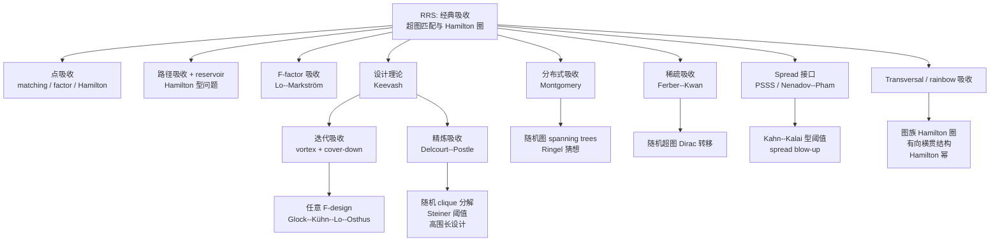

# 吸收方法综述：图论与极值组合中的 Absorption Method

> [!summary] 一句话版本
> 吸收方法把“几乎覆盖”升级为“完全覆盖”：先预留一个小而弹性的吸收器，再用主结构覆盖绝大多数对象，最后把剩余部分交给吸收器收尾。  
> 它是现代极值组合中处理完美匹配、Hamilton 圈、$F$-factor、分解、设计和随机/扰动模型的通用框架。

> [!tip] 读法
> 快速入门：读 **0. 导读**、**1. 一句话定义**、**2. 直观例子**、**3. 方法的基本蓝图**。  
> 追历史和技术：读 **4. 历史主线**、**5. 吸收器的类型**、**6. 技术分支**。  
> 找论文和问题：读 **9. 代表性成果年表**、**12. 开放问题与前沿方向**、**13. 推荐阅读路线**。

> 版本日期：2026-06-17  
> 范围：约 2006--2025，重点关注图论、超图、随机图、扰动随机图、分解与设计理论中的吸收方法  
> 写作目标：给出一份可读、可查、可继续扩展的中文 survey，而不是单篇论文笔记

---

## 0. 导读

吸收方法（absorption method）是现代极值组合中最重要的收尾技术之一。它的典型任务是：

> 已经找到了一个覆盖几乎所有顶点或边的结构，如何把剩下的少量对象也纳入进去，得到真正的生成结构？

这里的“生成结构”可以是完美匹配、Hamilton 圈、$F$-factor、树嵌入、图分解、超图分解、Steiner 系统，或者带颜色/图层约束的 transversal 结构。吸收方法的核心想法是提前预留一个小的、弹性的结构，让它能够在最后吸收不可预测的剩余部分。

一个最简模板是：

1. 先构造一个小吸收器 $A$；
2. 在 $G-A$ 中找到一个 almost-spanning 结构；
3. 把剩余集合 $L$ 交给 $A$；
4. 得到真正 spanning / perfect 的结构。

这听起来像一个简单的技巧，但它改变了很多问题的证明策略。许多传统方法只能给出“几乎覆盖”，而吸收方法把“最后一小块”的不确定性前置处理，使精确阈值、生成嵌入和分解问题变得可攻。

---

## 1. 一句话定义

设 $G$ 是图或超图，目标是在其中找到某个生成结构。一个小集合或小子结构 $A$ 是吸收器，如果它具有两种状态：

- **空载状态**：$G[A]$ 自身可以被目标结构局部覆盖；
- **吸收状态**：对任意足够小、满足必要整除条件的剩余集合 $L$，$G[A\cup L]$ 也可以被同类结构局部覆盖。

形式上常写成：

$$
|A|\le \varepsilon n,\qquad
\forall L\subseteq V(G)\setminus A,\ |L|\le \xi n,\quad
G[A\cup L]\text{ contains the desired local structure.}
$$

在匹配问题中，$A$ 和 $A\cup L$ 都有完美匹配；在 Hamilton 问题中，吸收路径的端点不变，但路径可以选择是否经过 $L$；在分解问题中，吸收器能把剩余边集并入一个完整分解。

---

## 2. 直观例子：为什么“吸收”有效

考虑完美匹配。假设我们想吸收两个顶点 $x,y$。如果能找到一个小集合 $S$，满足：

- $G[S]$ 有完美匹配；
- $G[S\cup\{x,y\}]$ 也有完美匹配；

那么 $S$ 就是 $\{x,y\}$ 的吸收器。主匹配如果已经覆盖了 $V(G)\setminus(S\cup\{x,y\})$，最后可以选择第二种匹配模式，把 $x,y$ 一起覆盖。

Hamilton 圈中也类似。我们构造一条短路径 $P$，端点是 $a,b$，满足：

- 不吸收时，$P$ 从 $a$ 到 $b$，覆盖自身内部顶点；
- 吸收时，另一条 $a$--$b$ 路径覆盖 $P$ 的内部顶点和若干剩余顶点；
- 端点 $a,b$ 不变，因此外部大圈不需要知道内部如何切换。

这就是吸收方法的美感：它把局部可替换性嵌入到全局结构中。

---

## 3. 方法的基本蓝图

### 3.1 三步蓝图

绝大多数吸收证明可以抽象为三步。

**第一步：吸收引理。**  
证明宿主结构中存在一个小吸收器 $A$，能够吸收任意小的剩余对象。

**第二步：几乎覆盖。**  
在去掉 $A$ 后，用其他工具覆盖几乎所有对象。这里常用：

- Rödl nibble；
- Pippenger--Spencer 型匹配定理；
- regularity lemma；
- blow-up lemma；
- sparse blow-up lemma；
- 随机贪心算法；
- reservoir 和 connecting lemma；
- hypergraph containers；
- conflict-free matching。

**第三步：吸收收尾。**  
把几乎覆盖后留下的 $L$ 放回 $A$ 中，用吸收引理完成精确覆盖。

### 3.2 四步蓝图：Hamilton 型问题

Hamilton 圈和路径问题通常需要多一个连接步骤：

1. 构造吸收路径 $P_{\mathrm{abs}}$；
2. 预留 reservoir $R$；
3. 在剩余图中找少量不交路径覆盖几乎所有顶点；
4. 用 $R$ 连接路径片段，用 $P_{\mathrm{abs}}$ 吸收剩余顶点。

这里 absorber 负责“点的剩余”，reservoir 负责“片段之间的连接”。

### 3.3 分解蓝图：边吸收

在设计理论和图分解中，吸收对象不是顶点，而是剩余边集。典型结构是：

1. 预留一个 omni-absorber；
2. 用 nibble 或 packing 方法做 almost-decomposition；
3. 用 cover-down 或局部修正让剩余边集满足吸收器输入条件；
4. 用 omni-absorber 完成最终分解。

边吸收比点吸收更复杂，因为剩余边集必须满足多层整除条件。

---

## 4. 历史主线

### 4.1 形成之前：局部修补思想

在“absorption method”成为固定术语之前，组合数学中已经有类似思想：先做大部分构造，再用预留结构修补余项。cycle decomposition、随机图嵌入、packing 问题中都能看到这种影子。

但这些早期技巧还不是一个统一方法。现代意义上的吸收方法，是在超图完美匹配和 Hamilton 圈问题中被系统化的。

### 4.2 RRS：现代吸收方法的起点

Rödl--Ruciński--Szemerédi 在 2006--2009 年的一系列论文中，把吸收方法作为系统工具用于超图：

- 完美匹配；
- 3-一致超图 Hamilton 圈；
- 一般 $k$-一致超图 Dirac 型问题；
- 精确 codegree 阈值。

这些工作确立了“吸收器 + 几乎覆盖 + 收尾”的范式，也说明吸收方法不仅能证明存在性，还能处理精确阈值。

### 4.3 2009--2015：扩散到稠密图、$F$-factor 与超图 Dirac 问题

RRS 之后，吸收方法迅速变成稠密图和超图中的通用收尾工具。

- Kühn--Osthus 将 absorption 与 regularity、blow-up、robust expansion 结合；
- Lo--Markström 将 absorption 推广到一般 $F$-factor；
- Zhao 等人的综述把 absorption 放入超图 Dirac 型问题的标准工具箱；
- Keevash 的 ICM survey 从超图匹配和设计的角度解释了 absorption 的威力。

这一阶段的吸收器大多仍是“经典吸收器”：显式构造很多小 gadget，再用随机选择和删交保证它们互不冲突。

### 4.4 2014 之后：设计理论与迭代吸收

Keevash 证明设计存在性之后，吸收方法进入了分解与设计理论的核心。这里的难点从“剩余顶点”升级为“剩余边集”，而剩余边集受到复杂整除条件约束。

Glock--Kühn--Lo--Osthus 发展了迭代吸收，用 purely probabilistic and combinatorial methods 证明任意 $F$-design 的存在性。其核心是：

- 构造嵌套的 vortex；
- 用 cover-down lemma 逐层推低剩余边；
- 最后由预留的 absorber 处理极小剩余。

这使 absorption 不再只是一个小 gadget 技巧，而成为一个大型证明架构。

### 4.5 2019 之后：分布式吸收

Montgomery 在随机图 spanning tree universality 中发展了分布式吸收。它的关键不是为每个可能剩余集合准备一个吸收器，而是构造一个低度、鲁棒可匹配的二分模板，把吸收能力分布到整个图中。

这条线后来在 Ringel 猜想的证明中发挥了重要作用。分布式吸收尤其适合树、随机图和 packing 问题，因为这些问题需要大量局部选择之间保持全局协调。

### 4.6 稀疏吸收、精炼吸收与 spread 接口

近年的三个重要方向是：

**稀疏吸收。**  
Ferber--Kwan 用 contraction 和 hypergraph containers 在随机超图中建立 Dirac 型转移定理。它的特点是非构造性地证明 absorber 存在，适合稀疏随机环境。

**精炼吸收。**  
Delcourt--Postle 提出 refined absorption，为设计存在性提供新的证明路线。Postle 2025 年的文章进一步把 refined absorption 描述为极值和概率设计理论中的黑箱化工具。

**spread 吸收/嵌入。**  
Pham--Sah--Sawhney--Simkin 的 robust threshold 工具和 Nenadov--Pham 的 spread blow-up lemma 把“存在一个结构”升级为“存在一个不集中概率质量的结构分布”，从而连接 Kahn--Kalai 型随机阈值理论。

---

## 5. 吸收器的类型

### 5.1 点吸收器

点吸收器用于吸收少量未覆盖顶点。它最常见于：

- 完美匹配；
- $F$-factor；
- Hamilton 圈；
- spanning tree；
- Hamilton cycle powers。

关键是构造能在“覆盖自己”和“覆盖自己加上剩余顶点”之间切换的小结构。

### 5.2 路径吸收器

路径吸收器用于 Hamilton 型问题。它的端点通常固定，因此可以作为大路径或大圈中的一个模块。吸收发生在模块内部，外部连接结构不需要改变。

这类吸收器常与 reservoir 配合。reservoir 提供连接路径，absorber 提供最终顶点收尾。

### 5.3 Tiling 吸收器

对于 $F$-factor 或 $H$-tiling，吸收器要保证：

$$
A\text{ has an }F\text{-tiling},\qquad A\cup L\text{ also has an }F\text{-tiling}.
$$

这里的难点是 $L$ 的大小和类型必须满足 $F$ 的整除约束。Lo--Markström 的 closedness 框架正是为这类问题服务。

### 5.4 Omni-absorber

分解问题中的 absorber 往往不是吸收某个具体小集合，而是吸收一个剩余空间中的任意合法对象。这种结构常称为 omni-absorber。

它出现在：

- Steiner systems；
- clique decompositions；
- hypergraph $F$-designs；
- high-girth designs；
- random design thresholds。

Omni-absorber 是吸收方法中最复杂的一类对象。

### 5.5 Transversal / rainbow 吸收器

在 transversal 或 rainbow 问题中，吸收器不仅要处理顶点和边，还要处理资源约束：

- 每条边必须来自不同颜色；
- 每条边必须来自指定图层；
- 有向图中方向也必须一致；
- 图族中的每个成员只能使用有限资源。

这类吸收器往往需要与 transversal regularity、transversal blow-up lemma 和颜色分配机制结合。

---

## 6. 技术分支

### 6.1 经典吸收

经典吸收的流程是：

1. 对每种小剩余模式证明有许多 absorber；
2. 随机抽取一批 absorber；
3. 删除相交或冲突的 absorber；
4. 证明剩下的集合仍能吸收任意小剩余。

优点是直接、透明、适合精确阈值。缺点是当剩余模式太多、宿主图太稀疏或分解约束太复杂时，显式 gadget 会变得笨重。

### 6.2 Reservoir 方法

Reservoir 是为连接预留的随机资源。它的典型性质是：即使删掉少量顶点，仍能连接许多指定端点对。

在 Hamilton 圈证明中，absorber 与 reservoir 经常成对出现：

- absorber：处理未覆盖顶点；
- reservoir：连接路径片段；
- connecting lemma：保证 reservoir 内有足够多短连接。

### 6.3 分布式吸收

分布式吸收的核心是 robustly matchable bipartite template。设有二分图：

$$
B=(X,Y\cup Z),
$$

它满足对很多 $Z_0\subseteq Z$，都存在把 $X$ 匹配到 $Y\cup Z_0$ 的完美匹配。再把 $X$ 的顶点替换为吸收 gadget，把 $Z$ 编码为未来可能剩余的对象。

这样，吸收器的灵活性来自模板匹配，而不是来自大量互相独立的局部 gadget。

代表应用：

- 随机图中的 spanning tree universality；
- Ringel 猜想；
- 某些 tree packing 和 universality 问题。

### 6.4 迭代吸收

迭代吸收使用一串嵌套集合：

$$
U_0\supseteq U_1\supseteq \cdots \supseteq U_t.
$$

第 $i$ 轮把当前剩余推入 $U_{i+1}$。经过多轮之后，剩余被限制在很小的 $U_t$ 中。最终 absorber 只需要处理这个很小位置里的剩余。

它的代表概念包括：

- vortex；
- cover-down lemma；
- transformers；
- absorbers；
- fractional decomposition；
- regularity boosting。

这条线是现代设计理论吸收方法的主干。

### 6.5 Cover-down

Cover-down lemma 的功能是把未覆盖边“往下推”。假设当前层是 $U_i$，下一层是 $U_{i+1}$。cover-down 要找到许多目标结构的拷贝，覆盖所有不应留在 $U_i\setminus U_{i+1}$ 的边，同时只少量消耗 $U_{i+1}$ 内部的边。

直观上，它不是立即消灭所有剩余，而是把剩余压缩到越来越小的位置。这就是迭代吸收能处理复杂分解问题的原因。

### 6.6 稀疏吸收

稀疏吸收处理随机超图或稀疏随机子图。经典显式吸收在稀疏环境中常常失败，因为小 gadget 的候选数量不够稳定。

Ferber--Kwan 的思路是：

- 从确定性 Dirac 型存在性出发；
- 用 contraction 把吸收器存在性转化为另一个结构问题；
- 用 hypergraph containers 控制坏事件；
- 得到随机环境下的 transference theorem。

这种方法的一个元优势是：不必完全知道确定性阈值的精确值，也能给出随机相对版本。

### 6.7 精炼吸收

Refined absorption 面向设计理论，目标是把复杂的迭代吸收步骤压缩、黑箱化。Delcourt--Postle 用它给出设计存在性猜想的新证明；后续工作把它用于：

- high-girth designs；
- random graph clique decompositions；
- Steiner system thresholds；
- extremal and probabilistic design theory 的统一框架。

与迭代吸收相比，精炼吸收强调更强的一次性 absorber 定理。它的理想形态是：以后做设计类应用时，不必重新证明吸收步骤，只需调用主吸收定理。

### 6.8 Spread 方法

Spread 方法关心的不是单个嵌入，而是嵌入集合上的概率分布。一个分布是 spread 的，大意是任意指定小集合同时出现的概率都不太大：

$$
\Pr[S\subseteq H]\le q^{|S|}.
$$

这种性质可以接入 Kahn--Kalai / Park--Pham 型随机阈值工具。Nenadov--Pham 的 spread blow-up lemma 说明，在 super-regular pairs 中不仅存在目标图拷贝，还能在这些拷贝上构造 spread 分布。

这使 blow-up lemma 从确定性嵌入工具变成可与随机阈值理论对接的概率接口。

### 6.9 Transversal / rainbow 吸收

Transversal absorption 处理图族或边着色图中的生成结构。目标结构每条边要来自不同颜色或不同图层。

近年应用包括：

- transversal Hamilton cycles；
- transversal Hamilton paths；
- transversal powers of Hamilton cycles；
- digraph collections 中的 transversal Hamilton cycles。

这里的难点在于，吸收器每次切换状态时不仅要保留图结构，还要保留颜色或图层资源的合法性。

---

## 7. 应用地图

### 7.1 超图完美匹配

这是吸收方法的发源地之一。目标是在 $k$-一致超图中找到完美匹配。典型条件是最小 codegree 或更一般的最小 $d$-degree 条件。

吸收的角色：

1. 构造一个能吸收少量顶点的 matching absorber；
2. 用 almost-perfect matching 覆盖大部分顶点；
3. 吸收剩余顶点。

代表作者与工作：

- Rödl--Ruciński--Szemerédi；
- Keevash--Mycroft；
- Ferber--Kwan 的随机超图转移版本。

### 7.2 Hamilton 圈与超图 cycles

Hamilton 型问题中，吸收通常与连接机制绑定。

常见目标：

- 图中的 Hamilton 圈；
- 有向 Hamilton 圈；
- 超图 loose Hamilton cycles；
- 超图 tight Hamilton cycles；
- Hamilton cycle powers $C_n^k$。

标准证明通常含有吸收路径、reservoir、connecting lemma 和 almost-cover lemma。

### 7.3 $F$-factor 与 tiling

$F$-factor 是把顶点集完全铺成若干个 $F$ 的拷贝。吸收方法把完美匹配的思想推广到更复杂的小图铺砌。

关键问题是：

- 如何定义两个顶点或小集合之间的可连接性；
- 如何保证 absorber 与 $F$ 的整除结构兼容；
- 如何把局部 closedness 推广为全局 factor。

代表工作是 Lo--Markström 的 hypergraph $F$-factors via absorption。

### 7.4 树嵌入与 universality

树嵌入是分布式吸收的主要舞台之一。Montgomery 证明随机图中 bounded-degree spanning tree universality，确认了 Kahn 的猜想。这里 absorber 不能只是一个小集中结构，因为大树的局部选择高度分散；分布式模板正好提供全局弹性。

Ringel 猜想的证明也属于这一技术谱系。它要求把完全图分解为同一棵树的拷贝，吸收方法在最后协调未嵌入部分和剩余边资源。

### 7.5 分解与设计

设计理论是吸收方法最深的应用领域之一。

典型问题：

- Steiner systems；
- clique decompositions；
- hypergraph $F$-designs；
- high-girth designs；
- random graph decompositions。

核心困难：

- 剩余对象是边集而不是顶点集；
- 有多层整除条件；
- 需要 almost-decomposition；
- 需要能够吸收任意合法剩余的 omni-absorber。

代表路线：

- Keevash：设计存在性；
- Glock--Kühn--Lo--Osthus：迭代吸收与任意 $F$-design；
- Delcourt--Postle：精炼吸收；
- Keevash 2024：设计存在性的短证明。

### 7.6 随机图与扰动随机图

随机图和扰动随机图中的吸收方法通常处理两类问题：

- 稀疏随机图自身是否包含某生成结构；
- 稠密确定性图加少量随机边后是否包含某生成结构。

常见模型：

$$
G(n,p),\qquad G_\alpha\cup G(n,p).
$$

代表结果包括：

- spanning bounded-degree graphs in randomly perturbed graphs；
- spanning tree universality；
- powers of Hamilton cycles；
- robust Corrádi--Hajnal；
- random hypergraph Dirac-type theorems。

### 7.7 Transversal 与 rainbow 结构

这是 2024--2025 年仍在快速发展的方向。给定图族 $G_1,\ldots,G_m$，一个 copy 是 transversal 的，如果它每条边来自不同 $G_i$。这类问题把 Dirac 型图论、颜色约束和吸收方法结合起来。

典型结果包括：

- transversal Hamilton cycles and paths；
- transversal Hamilton cycles in digraph collections；
- transversal powers of Hamilton cycles。

这说明 absorption 正从“顶点/边收尾工具”扩展为“资源约束下的收尾工具”。

---

## 8. 与其他方法的关系

### 8.1 Regularity lemma

Regularity lemma 负责把大图压缩成 reduced graph；吸收方法负责把 reduced-level 的 almost-spanning 结构变成原图中的精确生成结构。

典型组合：

$$
\text{regularity} \to \text{reduced graph} \to \text{blow-up embedding} \to \text{absorption}.
$$

### 8.2 Blow-up lemma

Blow-up lemma 用于在 super-regular pairs 中嵌入 bounded-degree spanning graphs。吸收通常处理嵌入之后的余数、端点连接或整除问题。

Spread blow-up lemma 则进一步提供概率分布，使 blow-up 技术能与随机阈值理论结合。

### 8.3 Nibble

Nibble 擅长构造 almost-perfect matching 或 almost-decomposition，但它通常不控制最后剩余的形状。吸收方法正好补上这一步。

设计理论中常见结构是：

$$
\text{nibble gives almost decomposition} + \text{absorber finishes}.
$$

### 8.4 Containers

Hypergraph containers 在稀疏环境中控制坏结构数量。稀疏吸收把 absorber 的存在性转化为可由 containers 管理的问题，从而得到随机转移定理。

### 8.5 Conflict-free matching

许多现代分解和嵌入问题需要选择大量小结构，同时避免局部冲突。Conflict-free matching 常用于组织这些选择，吸收器则处理最终无法由 matching 自动解决的剩余。

---

## 9. 代表性成果年表

| 年份 | 作者 | 关键词 | 意义 |
|---|---|---|---|
| 2006 | Rödl--Ruciński--Szemerédi | 超图匹配、Hamilton 圈 | 现代吸收方法形成 |
| 2009 | RRS | 精确 codegree 阈值 | 吸收方法产生精确极值结果 |
| 2009 | Kühn--Osthus | 稠密图嵌入综述 | absorption 与 regularity/blow-up 融合 |
| 2011/2015 | Lo--Markström | $F$-factor | 从匹配推广到一般 tiling |
| 2014 | Keevash | designs | 吸收进入设计理论核心 |
| 2016/2023 | Glock--Kühn--Lo--Osthus | iterative absorption | 任意 $F$-design 的组合证明 |
| 2019 | Montgomery | distributive absorption | 随机图 spanning tree universality |
| 2021 | Montgomery--Pokrovskiy--Sudakov | Ringel conjecture | 分布式吸收的重大应用 |
| 2022 | Ferber--Kwan | sparse absorption | 随机超图 Dirac 转移 |
| 2024 | Delcourt--Postle | refined absorption | 设计存在性的第三条路线 |
| 2024 | Nenadov--Pham | spread blow-up lemma | 嵌入理论与随机阈值接口 |
| 2024 | Keevash | short proof of designs | 更短的设计存在性证明 |
| 2025 | Postle | refined absorption applications | 精炼吸收的黑箱化与应用化 |
| 2025 | 多组作者 | transversal absorption | 图族、颜色、有向版本继续发展 |

---

## 10. 技术路线图

---

## 11. 如何阅读一篇吸收证明

阅读 absorption 论文时，建议先找以下八个问题的答案。

1. 目标结构是什么？  
   匹配、Hamilton 圈、factor、树、分解，还是 transversal 结构？

2. 被吸收对象是什么？  
   顶点、边、路径片段、颜色资源，还是整除余项？

3. 吸收器的两种状态是什么？  
   不吸收时如何覆盖？吸收时如何覆盖？

4. 吸收器从哪里来？  
   显式 gadget、随机抽样、模板、迭代构造，还是非构造性 container 证明？

5. 互不相交如何保证？  
   随机选择、删交、matching lemma、conflict-free matching，还是模板匹配？

6. 几乎覆盖用什么工具？  
   Nibble、regularity、blow-up、random greedy、reservoir、container？

7. 整除条件在哪里处理？  
   尤其在分解和设计问题中，这是核心。

8. 最后拼接是否需要 connecting lemma？  
   Hamilton 型问题几乎总需要。

---

## 12. 开放问题与前沿方向

### 12.1 方法问题

1. **吸收器尺寸下界。**  
   在给定 Dirac 型条件下，最小 absorber 可以多小？是否存在统一的信息论下界？

2. **构造性与算法性。**  
   很多吸收器只由概率方法证明存在。能否给出高效算法，甚至自动生成 absorber gadget？

3. **统一框架。**  
   经典吸收、分布式吸收、稀疏吸收、精炼吸收和 spread 方法是否能被放进一个共同抽象？

4. **减少 regularity 依赖。**  
   在稠密图和超图问题中，能否用更轻量的工具替代 regularity/blow-up，再由 absorption 收尾？

5. **吸收失败的结构理论。**  
   如果吸收器不存在，宿主图是否必然接近某个极值反例？

### 12.2 应用问题

1. **Hamilton 幂的扰动随机精确阈值。**  
   对一般 $C_n^k$，近似阈值能否推进到精确阈值？

2. **随机设计阈值。**  
   refined absorption 与 spread distribution 是否能系统解决更多随机 Steiner system 和 clique decomposition 阈值？

3. **一般 $F$-design 的定量界。**  
   $n_0(F)$ 的有效估计能否显著改进？

4. **有向与横贯理论。**  
   Directed / transversal absorption 能否形成像无向图中那样稳定的标准工具箱？

5. **自动化 absorber 搜索。**  
   对固定小图 $F$ 或固定超图模式，能否用 SAT、ILP 或计算机搜索找到最短 absorber？

---

## 13. 推荐阅读路线

### 13.1 入门路线

1. Zhao, *Recent advances on Dirac-type problems for hypergraphs*。  
   用超图 Dirac 问题理解 absorption 为什么自然出现。

2. Kühn--Osthus, *Embedding large subgraphs into dense graphs*。  
   看 absorption 如何与 regularity、blow-up、robust expansion 配合。

3. Lo--Markström, *$F$-factors in hypergraphs via absorption*。  
   从完美匹配推广到一般 tiling。

### 13.2 现代技术路线

1. Montgomery, *Spanning trees in random graphs*。  
   学分布式吸收。

2. Ferber--Kwan, *Dirac-type theorems in random hypergraphs*。  
   学稀疏吸收和 transference。

3. Glock--Kühn--Lo--Osthus, *The existence of designs via iterative absorption*。  
   学迭代吸收、vortex、cover-down。

4. Delcourt--Postle, *Refined Absorption* 系列。  
   学精炼吸收和设计理论的新黑箱。

5. Nenadov--Pham, *Spread blow-up lemma*。  
   学 spread 接口和随机阈值方向。

### 13.3 如果只读十篇

1. RRS, *A Dirac-type theorem for 3-uniform hypergraphs*。
2. RRS, *Perfect matchings in large uniform hypergraphs with large minimum collective degree*。
3. Kühn--Osthus, *Embedding large subgraphs into dense graphs*。
4. Lo--Markström, *$F$-factors in hypergraphs via absorption*。
5. Keevash, *The existence of designs*。
6. Montgomery, *Spanning trees in random graphs*。
7. Montgomery--Pokrovskiy--Sudakov, *A proof of Ringel's conjecture*。
8. Ferber--Kwan, *Dirac-type theorems in random hypergraphs*。
9. Glock--Kühn--Lo--Osthus, *The existence of designs via iterative absorption*。
10. Delcourt--Postle, *Refined Absorption: A New Proof of the Existence Conjecture*。

---

## 14. 术语表

| 术语 | 说明 |
|---|---|
| absorber | 能在不同覆盖状态之间切换的小结构 |
| absorbing set | 由许多 absorber 组成的吸收集合 |
| absorbing path | Hamilton 型问题中的路径吸收器 |
| reservoir | 预留的连接资源 |
| almost-cover | 覆盖除少量对象外的几乎全部结构 |
| nibble | 半随机贪心选择方法 |
| closedness | $F$-factor 吸收中描述顶点可连接性的概念 |
| robustly matchable template | 分布式吸收中的鲁棒二分匹配模板 |
| vortex | 迭代吸收中的嵌套集合序列 |
| cover-down | 把剩余对象推入更小 vortex 的引理 |
| omni-absorber | 能吸收许多合法剩余边集的通用吸收器 |
| transference | 从确定性结论转移到随机稀疏环境的原则 |
| spread distribution | 不集中在少数指定对象上的概率分布 |
| transversal copy | 每条边来自不同图层或颜色的拷贝 |

---

## 15. 主要参考文献

### 15.1 经典吸收

- V. Rödl, A. Ruciński, E. Szemerédi, *Perfect matchings in uniform hypergraphs with large minimum degree*, European J. Combin. 27 (2006), 1333--1349.
- V. Rödl, A. Ruciński, E. Szemerédi, *A Dirac-type theorem for 3-uniform hypergraphs*, Combin. Probab. Comput. 15 (2006), 229--251.
- V. Rödl, A. Ruciński, E. Szemerédi, *An approximative Dirac-type theorem for $k$-uniform hypergraphs*, Combinatorica 28 (2008), 229--260.
- V. Rödl, A. Ruciński, E. Szemerédi, *Perfect matchings in large uniform hypergraphs with large minimum collective degree*, JCT-A 116 (2009), 613--636.

### 15.2 综述与背景

- D. Kühn, D. Osthus, *Embedding large subgraphs into dense graphs*, Surveys in Combinatorics 2009, arXiv:0901.3541.
- Y. Zhao, *Recent advances on Dirac-type problems for hypergraphs*, arXiv:1508.06170.
- J. Böttcher, *Large-scale structures in random graphs*, Surveys in Combinatorics 2017, arXiv:1702.02648.
- P. Keevash, *Hypergraph matchings and designs*, ICM survey.

### 15.3 $F$-factor 与 Hamilton/tiling

- A. Lo, K. Markström, *$F$-factors in hypergraphs via absorption*, Graphs Combin. 31 (2015), 679--712, arXiv:1105.3411.
- L. Gan, J. Han, L. Sun, G. Wang, *Large $Y_{k,b}$-tilings and Hamilton $\ell$-cycles in $k$-uniform hypergraphs*, JGT 104 (2023), 516--556, arXiv:2109.00722.

### 15.4 设计与分解

- P. Keevash, *The existence of designs*, arXiv:1401.3665.
- S. Glock, D. Kühn, A. Lo, D. Osthus, *The existence of designs via iterative absorption*, Memoirs AMS 284 (2023), no. 1406, arXiv:1611.06827.
- A. Lo, S. Piga, N. Sanhueza-Matamala, *Cycle decompositions in $k$-uniform hypergraphs*, JCTB 167 (2024), 55--103, arXiv:2211.03564.
- P. Keevash, *A short proof of the existence of designs*, arXiv:2411.18291.
- M. Delcourt, L. Postle, *Refined Absorption: A New Proof of the Existence Conjecture*, arXiv:2402.17855.
- M. Delcourt, L. Postle, *Proof of the High Girth Existence Conjecture via Refined Absorption*, arXiv:2402.17856.
- M. Delcourt, T. Kelly, L. Postle, *Clique Decompositions in Random Graphs via Refined Absorption*, arXiv:2402.17857.
- M. Delcourt, T. Kelly, L. Postle, *Thresholds for $(n,q,2)$-Steiner Systems via Refined Absorption*, arXiv:2402.17858.
- M. Delcourt, T. Kelly, L. Postle, *A Short Proof of the Existence of $K_q^r$-absorbers*, arXiv:2412.09710.
- L. Postle, *Refined Absorption: A New Proof of the Existence Conjecture and its Applications to Extremal and Probabilistic Design Theory*, arXiv:2510.19978.

### 15.5 分布式与稀疏吸收

- R. Montgomery, *Spanning trees in random graphs*, Advances in Mathematics 356 (2019), 106793, arXiv:1810.03299.
- R. Montgomery, A. Pokrovskiy, B. Sudakov, *A proof of Ringel's conjecture*, GAFA 31 (2021), 663--720, arXiv:2001.02665.
- A. Ferber, M. Kwan, *Dirac-type theorems in random hypergraphs*, JCTB 155 (2022), 318--357, arXiv:2006.04370.
- K. Petrova, M. Trujić, *Transference for loose Hamilton cycles in random 3-uniform hypergraphs*, RSA 65 (2024), 313--341, arXiv:2205.11421.

### 15.6 随机扰动图、spread 与 transversal

- J. Böttcher, R. Montgomery, O. Parczyk, Y. Person, *Embedding spanning bounded degree graphs in randomly perturbed graphs*, Mathematika 66 (2020), 422--447, arXiv:1802.04603.
- J. Böttcher, J. Han, Y. Kohayakawa, R. Montgomery, O. Parczyk, Y. Person, *Universality for bounded degree spanning trees in randomly perturbed graphs*, RSA 55 (2019), 854--864, arXiv:1802.04707.
- J. Böttcher, O. Parczyk, A. Sgueglia, J. Skokan, *The square of a Hamilton cycle in randomly perturbed graphs*, RSA 65 (2024), 342--386, arXiv:2202.05215.
- H. T. Pham, A. Sah, M. Sawhney, M. Simkin, *A toolkit for robust thresholds*, arXiv:2210.03064.
- R. Nenadov, H. T. Pham, *Spread blow-up lemma with an application to perturbed random graphs*, arXiv:2410.06132.
- Y. Cheng, K. Staden, *Stability of transversal Hamilton cycles and paths*, arXiv:2403.09913.
- Y. Cheng, R. Li, G. Sun, G. Wang, *Transversal Hamilton cycles in digraph collections*, arXiv:2501.00998.
- E. Heath, J. Hyde, N. Morrison, S. Ogden, *Universality for transversal powers of Hamilton cycles*, arXiv:2510.18163.

### 15.7 对照方向

- R. Lang, N. Sanhueza-Matamala, *A hypergraph bandwidth theorem*, arXiv:2412.14891.

这篇作为对照很有价值：它探索不依赖 regularity、blow-up 和 absorption 的新框架，有助于看清吸收方法的边界。

---

## 16. 在线核查链接

- Refined absorption 2025 survey/application: <https://arxiv.org/abs/2510.19978>
- Delcourt--Postle refined absorption: <https://arxiv.org/abs/2402.17855>
- GKLO iterative absorption: <https://arxiv.org/abs/1611.06827>
- Nenadov--Pham spread blow-up lemma: <https://arxiv.org/abs/2410.06132>
- Ferber--Kwan sparse absorption: <https://arxiv.org/abs/2006.04370>
- Montgomery spanning trees: <https://arxiv.org/abs/1810.03299>
- Ringel conjecture proof: <https://arxiv.org/abs/2001.02665>
- Transversal Hamilton cycles in digraph collections: <https://arxiv.org/abs/2501.00998>
- Transversal powers of Hamilton cycles: <https://arxiv.org/abs/2510.18163>

